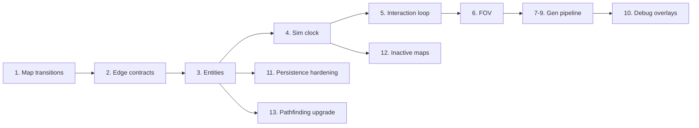

# Implementation Plan: ContinuousMap Features

This plan maps the 14 items in `ContinuousMap.md` onto the existing Rouge solution. The codebase already has a strong base: coordinate types, 64×64 overworld/local split, deterministic generation, terrain mutation persistence, JSON save/load, and BFS pathfinding. What is missing is the **continuous world loop** — edge transitions, entities, simulation time, and the supporting generation/persistence layers.

---

## Current baseline

| Area | Status | Key files |
|------|--------|-----------|
| Coordinates | Done | `WorldCoord`, `LocalCoord`, `GlobalTileCoord`, `CoordinateMath` |
| Overworld ↔ local modes | Partial | `GameSession.EnterWorldCell()` / `LeaveLocalMap()` — manual, center spawn |
| Local movement | Partial | `TryMoveLocal` stops at edges; no cross-cell transition |
| Terrain persistence | Done | `ILocalMapRepository`, `PersistentLocalMapRepository`, `SaveManager` |
| Generation | Monolithic | `LocalMapGenerator.GenerateForest` etc. — no passes or edge contracts |
| Entities / time / FOV | Missing | Player is session fields; trees are `TerrainId.Tree` |
| Pathfinding | BFS only | `GridPathfinder` — no costs, no NPC consumer |

The critical gap today is in `GameSession.TryMoveLocal`: movement fails at the boundary instead of transitioning.

```84:87:e:\CursorApps\Rouge\src\Game.Simulation\Session\GameSession.cs
        if (!ActiveLocalMap.Contains(next))
        {
            return false;
        }
```

---

## Recommended implementation order

Follow the doc’s sequence. Each phase builds on the previous one.



---

## Phase 1: Geographic map transitions

**Goal:** Walking off a local-map edge enters the neighboring overworld cell at the corresponding edge position.

### New types (`Game.Simulation`)

```
Game.Simulation/World/
  MapTransition.cs          // record struct: DestinationWorld, DestinationLocal
  MapTransitionResolver.cs  // edge → transition logic
```

### Changes

| File | Change |
|------|--------|
| `GameSession.TryMoveLocal` | When `next` is out of bounds, resolve `MapTransition` instead of returning false |
| `GameSession.EnterWorldCell` | Accept optional `LocalCoord` entry point (for transitions, not always center) |
| `AdvanceMovement` | Handle transition mid-path: unload current map, load neighbor, continue |
| `SimulationHost` | No view-mode change on edge cross — stay in `LocalMap` mode |

### Logic

```
East edge (63, y)  → World(x+1, y), Local(0, y)
West edge (0, y)   → World(x-1, y), Local(63, y)
North edge (x, 0)  → World(x, y-1), Local(x, 63)
South edge (x, 63) → World(x, y+1), Local(x, 0)
```

Clamp at overworld bounds — no transition outside the 64×64 grid.

### Tests (`Game.Simulation.Tests`)

- `MapTransitionTests`: all four edges, round-trip preserves mutations
- `MapTransitionTests`: world boundary blocks exit
- `PersistenceTests`: transition position survives save/load

### Acceptance criteria (from doc)

- Correct neighbor cell and mirrored edge position
- Return trip restores same map with prior terrain edits
- Order-independent (repository cache, not generation order)

**Estimated scope:** ~3–4 files, 1 new module, 5–8 tests

---

## Phase 2: Edge-generation contracts

**Goal:** Adjacent maps agree on boundary features (start with roads).

### New types (`Game.Simulation` + `Game.Generation`)

```
Game.Simulation/World/
  ConnectionFlags.cs
  EdgeConnection.cs       // Direction, LocalOffset, ConnectionType, Width
  WorldCell.cs            // add Connections or derive from regional features

Game.Generation/
  Regional/
    RegionalFeatureGraph.cs   // shared road/river segments at world scale
  Passes/
    BoundaryConnectionPass.cs // stamps road tiles at edges from contracts
```

### Approach

1. During overworld generation (or a pre-pass), derive `EdgeConnection` lists per cell from a **regional** road graph — not per-map random rolls.
2. Pass connections into `LocalGenerationContext` (Phase 7 formalizes this; stub the context now).
3. `BoundaryConnectionPass` carves a walkable path from each edge portal into the interior.

### Tests

- Two adjacent cells: east road on cell A aligns with west road on cell B
- Deterministic: same seed → same connections

**Depends on:** Phase 1 (you need to walk across borders to verify)

**Estimated scope:** ~5–6 files, moderate complexity

---

## Phase 3: Stable entities

**Goal:** Separate terrain from occupiers; introduce persistent entity IDs.

### New module (`Game.Simulation/Entities/`)

```
EntityId.cs
Entity.cs                 // Id, WorldPosition, LocalPosition, BlocksMovement, IsActive
EntityRegistry.cs         // per-map or per-world store
EntityFactory.cs          // deterministic spawn IDs from seed + coord
IEntityStore.cs           // get/add/remove by map
```

### Migration strategy

- **Do not** add trees/creatures to `TerrainId` going forward.
- Keep existing `TerrainId.Tree` for generated maps initially; Phase 7’s entity spawn pass replaces tree terrain with tree entities.
- Player becomes entity `EntityId.Player` (session keeps convenience accessors).

### Persistence

Extend `LocalMapSaveData` / serializer:

```csharp
List<EntitySaveData> Entities
```

### Spawn (minimal)

| Entity | Purpose |
|--------|---------|
| Player | Already exists; wrap as entity |
| Harvestable tree | Stationary, one per map (deterministic spawn) |
| Wandering creature | One per forest map |

### Tests

- Entity survives leave → re-enter
- Entity survives save/load
- `BlocksMovement` respected by pathfinding

**Depends on:** Phase 1 (entities need world+local position across cells)

**Estimated scope:** New `Entities/` folder, ~8 files, serializer changes

---

## Phase 4: Simulation clock (energy scheduler)

**Goal:** Player actions advance simulation time; creatures act by energy, not frames.

### New module (`Game.Simulation/Time/`)

```
SimulationClock.cs        // current tick, world time
ActorTurnState.cs         // Energy, Speed
ActionCostTable.cs        // Walk=100, Wait=100, Harvest=200, etc.
TurnScheduler.cs          // advance all actors each player action
```

### Refactor

| Current | Target |
|---------|--------|
| `SimulationHost.Tick()` every frame | Tick only on **committed player action** |
| `AdvanceMovement()` one tile/frame | Movement consumes energy; one tile = one action |
| Frame loop drives sim | Render loop decoupled — pause rendering without advancing sim |

### `SimulationHost` changes

```
ApplyIntent(Move)     → queue path step OR immediate step → spend energy → run scheduler
ApplyIntent(Wait)     → spend 100 energy → run scheduler until player can act again
Scheduler loop        → while any actor Energy >= 100: perform AI action, deduct cost
```

### Creature AI (minimal)

- One `WanderGoal`: random valid adjacent tile via pathfinder (Phase 13)
- Only runs when creature’s map is **Active** (Phase 12)

### Client

- Debug UI: world time, player energy, creature energy
- Optional: “waiting for input” vs “simulating” indicator

### Tests

- Player wait advances creature position
- Faster creature (Speed=120) acts more often over N player waits
- Paused render does not change sim state (headless: N render frames, 0 sim ticks)

**Depends on:** Phase 3 (creatures are entities)

**Estimated scope:** ~6 files, significant `SimulationHost` refactor

---

## Phase 5: One complete interaction loop

**Goal:** End-to-end harvest flow proving entity + time + inventory + persistence.

### New module (`Game.Simulation/Items/`)

```
ItemId.cs
ItemStack.cs
Inventory.cs              // player only, initially
GroundItem.cs             // entity subtype or component
```

### Interaction: harvest tree

```
1. Player adjacent to tree entity
2. Interact intent (context menu or key)
3. Spend 200 energy (Harvest cost)
4. Remove tree entity; optionally leave stump terrain
5. Create wood ItemStack on ground (or direct to inventory)
6. Autosave (Phase 11 formalizes; hook SaveManager here)
7. Leave map → return → tree gone, wood present
```

### Content

Add to `content/`:

```yaml
# items/wood.yaml, interactions/harvest_tree.yaml
```

### Tests

- Full harvest loop persistence
- Inventory take from ground
- Action blocked if insufficient energy (if you gate that way)

**Depends on:** Phases 3, 4, 11 (partial — at minimum call `SaveManager.Save` after interaction)

**Estimated scope:** ~5 files + YAML content

---

## Phase 6: Field of view and map memory

**Goal:** Unseen / Remembered / Visible per tile; shadowcasting.

### New module (`Game.Simulation/Perception/`)

```
VisibilityState.cs        // Unseen, Remembered, Visible
VisibilityMap.cs          // byte[] per local map, same dimensions as terrain
FieldOfViewCalculator.cs  // symmetric shadowcasting
```

### Integration

- Recompute FOV after each player move/wait
- `BlocksVision` on terrain **and** entities
- `WorldRenderer`: dim/fog Remembered, hide Unseen, full brightness Visible
- Per-map visibility memory persists while map is cached; reset or decay is optional for v1

### Tests

- Tree blocks sight behind it
- Remembered tiles stay after moving away
- Unseen tiles not in render snapshot (or marked for renderer)

**Depends on:** Phase 3 (entities block vision), Phase 4 (recompute after actions)

**Estimated scope:** ~4 files + renderer changes

---

## Phase 7: Generation pass pipeline

**Goal:** Replace monolithic `GenerateForest` with ordered passes.

### New structure (`Game.Generation/`)

```
Passes/
  IGenerationPass.cs
  LocalGenerationContext.cs
  InitializeTerrainPass.cs
  ElevationPass.cs
  WaterPass.cs
  GroundCoverPass.cs
  VegetationPass.cs          // Phase 8 upgrades this
  ObstaclesPass.cs
  BoundaryConnectionPass.cs  // Phase 2
  PointsOfInterestPass.cs
  NavigabilityValidationPass.cs  // Phase 9
  EntitySpawnPass.cs             // Phase 3
LocalMapGenerator.cs           // orchestrates pass list per biome
```

### Refactor `LocalMapGenerator`

```csharp
foreach (var pass in _passes)
    pass.Execute(map, context);
```

Biome-specific pass lists (forest gets vegetation; ocean skips most).

**Depends on:** Phases 2, 3, 9 (validation pass), 8 (vegetation pass content)

**Estimated scope:** Split existing generator methods into ~10 pass files

---

## Phase 8: Spatial coherence in generation

**Goal:** Patches and clearings instead of independent random tree rolls.

### New (`Game.Generation/Fields/`)

```
DensityField.cs           // low-freq + high-freq noise blend
SuitabilityCalculator.cs  // tree-density × soil × moisture × road distance
```

### Changes

- `VegetationPass` samples suitability threshold instead of `random.NextDouble() < 0.3`
- Reuse existing `ValueNoise` and moisture/elevation from context
- Store intermediate fields in `LocalGenerationContext` for debug overlays (Phase 10)

**Depends on:** Phase 7 pipeline

---

## Phase 9: Generator validation

**Goal:** Reject or repair unplayable maps deterministically.

### New (`Game.Generation/Validation/`)

```
NavigabilityValidator.cs  // flood fill from entry/spawn
ValidationResult.cs       // reachability %, isolated pockets
RetryPolicy.cs            // seed' = Hash(originalSeed, retryNumber)
```

### Rules (v1)

- Player entry walkable
- Edge connections reach interior
- ≥90% walkable tiles reachable from spawn (configurable)
- No spawn inside blocking entity

### Integration

- `NavigabilityValidationPass` runs last; on failure, regenerate with derived retry seed (max 3 retries)

### Tests

- Known bad seed triggers retry
- Retry is deterministic
- Valid map passes first attempt

**Depends on:** Phase 7

---

## Phase 10: Debug overlays

**Goal:** Inspect generation and sim state in-game before complexity grows.

### New (`Game.Client/Debug/`)

```
DebugOverlayController.cs
DebugOverlayMode.cs       // flags enum: Terrain, Collision, Moisture, FOV, etc.
TileInspector.cs          // click tile → dump panel
```

### Toggle keys (example)

| Key | Overlay |
|-----|---------|
| F1 | Terrain IDs |
| F2 | Collision |
| F3 | Moisture / generation fields |
| F4 | Entity positions + IDs |
| F5 | FOV state |
| F6 | Map boundaries + world/local coords |

Move manual save off F5 if it conflicts.

### Tile inspector output (from doc)

```
Global tile: 1482, 2031
World cell: 23, 31
Local tile: 10, 47
Terrain: Grass | Entity: Oak Tree #18842 | Visible: Yes
```

**Depends on:** Phases 6–9 (meaningful data to display)

---

## Phase 11: Persistence hardening

**Goal:** Versioned, testable, atomic saves.

### Changes (`Game.Persistence`)

```
Serialization/SaveHeader.cs     // FormatVersion, GeneratorVersion, WorldSeed, CreatedUtc
Saves/AtomicSaveWriter.cs       // .tmp → backup → rename
SaveManager.cs                  // validate version on load; reject or migrate
```

### Extend save payload

- Entities (Phase 3)
- Inventory (Phase 5)
- Simulation clock state (Phase 4)
- Per-map visibility memory (Phase 6, optional)

### Tests

| Test | |
|------|--|
| Round-trip unchanged | |
| Terrain mutation | exists |
| Entity add/remove | new |
| Cross-map position | new |
| Corrupt/missing map file | graceful fallback to regen + warn |
| Old format rejection | new |
| Deterministic regen of untouched map | new |

### Autosave triggers

- After harvest/interaction (Phase 5)
- On local-map leave (optional)
- On quit (exists)

**Can start early:** `SaveHeader` and atomic write in parallel with Phase 3

---

## Phase 12: Inactive-map handling

**Goal:** Only the active map runs full AI; others cache or unload.

### New (`Game.Simulation/Maps/`)

```
MapActivityState.cs       // Active, Cached, Unloaded
MapLifecycleManager.cs    // track state per WorldCoord
InactiveCatchUp.cs        // abstract time advancement on re-entry
```

### v1 behavior

| State | Behavior |
|-------|----------|
| **Active** | Player present; full creature AI |
| **Cached** | In memory; no AI ticks |
| **Unloaded** | On disk only; evict from `InMemoryLocalMapRepository` after N cached maps |

### On leave map

```
Record SimulationClock.TimeAtUnload
Persist entity states
Set state → Cached
```

### On re-enter

```
Elapsed = now - TimeAtUnload
Apply simple catch-up (plant growth, food decay — stubs OK initially)
Set state → Active
```

Do **not** replay individual turns.

**Depends on:** Phases 3, 4

---

## Phase 13: Pathfinding at two scales

**Goal:** Weighted local A* for creatures; keep overworld routing separate.

### Changes

| File | Change |
|------|--------|
| `GridPathfinder.cs` | Add `AStarPathfinder` with tile cost callback |
| `LocalMap` | `GetMovementCost(LocalCoord)` from terrain |
| `GameSession.BuildPathTo` | Optional: use costs for local paths |
| New `OverworldPathfinder.cs` | Biome travel costs (defer rivers/danger) |

### Creature use

- Wander AI uses local A* with collision + entity blocking
- Distant NPC travel: overworld cell graph only (stub for later)

**Depends on:** Phase 3 (entity collision), Phase 4 (creature turns)

---

## Phase 14: Milestone integration (“Continuous World and First Actor”)

Consolidate Phases 1–11 into one shippable milestone. Use this checklist before moving on:

### World traversal
- [ ] Edge transitions with mirrored position
- [ ] At least one shared boundary road (Phase 2)
- [ ] Transitions work after save/load

### Entities
- [ ] Stable `EntityId`
- [ ] One persistent creature
- [ ] One harvestable object
- [ ] Ground items + basic inventory

### Simulation
- [ ] Energy scheduler
- [ ] Wait action
- [ ] Action costs for move/interact
- [ ] World time in debug UI

### Perception
- [ ] FOV with three visibility states
- [ ] Vision-blocking terrain and entities

### Generation
- [ ] Pass pipeline
- [ ] Coherent vegetation
- [ ] Walkability validation
- [ ] Debug overlays for fields/connectivity

### Persistence
- [ ] Entities + inventory in save
- [ ] Cross-cell position
- [ ] Version header + atomic save

---

## Suggested sprint breakdown

| Sprint | Phases | Deliverable |
|--------|--------|-------------|
| **Sprint 1** | 1, 11 (header + atomic write) | Walk across map edges; safer saves |
| **Sprint 2** | 2, 7 (skeleton), 9 (basic) | Roads align at borders; pass pipeline stub |
| **Sprint 3** | 3, 13 (local A*) | Entities persist; creature can path |
| **Sprint 4** | 4, 5 | Turn-based play; harvest loop works |
| **Sprint 5** | 6, 10 | FOV + debug tools |
| **Sprint 6** | 8, 12, 14 polish | Coherent forests; inactive maps; milestone QA |

---

## What to postpone (per doc)

Do not implement yet: combat, factions, economics, settlements, weather, breeding, dialogue, quests, multiplayer, large item catalogs, ecological simulation. These all depend on the milestone above.

---

## Project layout after milestone

```
src/Game.Simulation/
  Coordinates/          (existing)
  Entities/             NEW
  Items/                NEW
  Time/                 NEW
  Perception/           NEW
  Maps/                 NEW — lifecycle
  World/                + MapTransition, EdgeConnection
  Session/              refactored GameSession
  Pathfinding/          + AStarPathfinder

src/Game.Generation/
  Passes/               NEW
  Fields/               NEW
  Validation/           NEW
  Regional/             NEW

src/Game.Persistence/
  Serialization/        + SaveHeader, EntitySaveData
  Saves/                + AtomicSaveWriter

src/Game.Client/
  Debug/                NEW
  Presentation/         FOV rendering

tests/Game.Simulation.Tests/
  MapTransitionTests.cs
  EntityPersistenceTests.cs
  TurnSchedulerTests.cs
  HarvestInteractionTests.cs
  FieldOfViewTests.cs
  GenerationValidationTests.cs
  SaveVersionTests.cs
```

---

## Immediate next step

Start with **Phase 1** — it has the highest payoff and the smallest dependency surface:

1. Add `MapTransition` + `MapTransitionResolver`
2. Change `TryMoveLocal` / `AdvanceMovement` to transition instead of stopping
3. Update `EnterWorldCell(LocalCoord? entry = null)`
4. Add round-trip and save/load transition tests

That turns the project from “menu of separate maps” into a **navigable continuous world**, which everything else in `ContinuousMap.md` is built on.

If you want, I can turn Sprint 1 into concrete tasks (types, method signatures, and test cases) or start implementing Phase 1 directly.