# Island Generation Pipeline

This document describes the complete island generation system in Blue Harvest RPG: how it is invoked, what configuration drives it, every stage in execution order, the field math underneath, and the data structures that carry state through the pipeline.

The orchestrator is `IslandPlanner` (`src/Game.Generation/Island/IslandPlanner.cs`). Production callers use `IslandWorldGenerator`, which runs the planner and then applies post-plan world features (rivers, roads).

---

## Table of Contents

1. [Architecture Overview](#architecture-overview)
2. [Entry Points](#entry-points)
3. [Configuration](#configuration)
4. [Pipeline Stages](#pipeline-stages)
5. [Field Generation](#field-generation)
6. [Data Structures](#data-structures)
7. [Supporting Utilities](#supporting-utilities)
8. [Post-Plan World Assembly](#post-plan-world-assembly)
9. [Preview Tooling](#preview-tooling)
10. [Tests](#tests)
11. [File Index](#file-index)

---

## Architecture Overview

Generation is **deterministic**: a single `ulong seed` drives all stages. Each stage derives its own sub-seed via `SeedUtility.DeriveStage(seed, salt)` so stage order and salt values are stable contracts.

The pipeline operates on an `IslandPlan` — a width × height grid of `IslandCellData` plus auxiliary per-cell float arrays (mask, coast distance, Voronoi fields) and graph/placement collections (roads, tunnels, structures, etc.).

Two silhouette paths exist, controlled by `IslandDefinition.UseLegacyIslandMask`:

| Path | Flag | Silhouette source | Elevation source |
|------|------|-------------------|------------------|
| **Modern (production)** | `useLegacyIslandMask: false` | Blob SDF union/subtract + coastline variation | Coast-distance ramp + ridge splines + noise |
| **Legacy** | `useLegacyIslandMask: true` | Elliptical SDF + multi-scale FBM noise | Mask-weighted noise blend + Voronoi ridges |

Production config in `content/generation/island.yaml` uses the modern path.

```mermaid
flowchart TD
    subgraph overscan["Overscan Shape"]
        A0[Overscan IslandMaskStage] --> B0[CoastDistanceStage]
        B0 --> C0[CoastlineCleanupStage]
        C0 --> D0[CoastlineVariationStage]
        D0 --> Q0[MaskQualityStage]
        Q0 --> CR[CropCenter]
    end

    subgraph regions["Regions & Geology"]
        CR --> E[VoronoiRegionStage]
        E --> F[TectonicPlateSetupStage]
        F --> G[LandmassStage.Execute]
        G --> H[TectonicBoundaryStage]
        H --> I[LandmassStage.Reconcile]
        I --> J[VolcanicActivityStage]
        J --> K[ErosionStage]
        K --> L[LandmassStage.Reconcile]
    end

    subgraph terrain["Terrain & Biomes"]
        L --> M[LandConnectivityStage]
        M --> CD[CoastDistance refresh]
        CD --> DF[DerivedFieldsStage]
        DF --> CL[CoastalLandformStage]
        CL --> N[BathymetryStage]
        N --> O[RegionBiomeStage]
        O --> BC1[BiomeCoherenceStage]
    end

    subgraph facilities["Facilities & Balance"]
        BC1 --> P[RoadNetworkStage]
        P --> Q[ParkLayoutStage]
        Q --> R[PaddockStage]
        R --> S[MaintenanceStage]
        S --> T[RuinsStage]
        T --> U[TunnelStage]
        U --> V[BiomeFinalizeStage]
        V --> W[IslandBalanceStage]
        W --> BC2[BiomeCoherenceStage final]
        BC2 --> X[BathymetryStage 2nd pass]
        X --> Y[SanitizeOceanCells]
        Y --> Z[StructureFinalizeStage]
    end
```



---

## Entry Points

### `IslandPlanner` — core orchestrator

```csharp
// src/Game.Generation/Island/IslandPlanner.cs
public IslandPlan Generate(int width, int height, ulong seed)
```

Constructor dependencies:

| Dependency | Default | Purpose |
|------------|---------|---------|
| `IslandDefinition config` | required | All scalar and shape parameters |
| `StructureBlueprintCatalog?` | `StructureBlueprintCatalogDefaults.Create()` | Blueprint IDs for structures |
| `BiomeRulesDefinition?` | empty | Elevation/moisture thresholds for biome assignment |

### `IslandWorldGenerator` — production wrapper

```csharp
// src/Game.Generation/WorldGen/IslandWorldGenerator.cs
public Overworld Generate(ulong seed)
```

1. Calls `IslandPlanner.Generate(width, height, seed)` → `IslandPlan`
2. Creates `Overworld` and attaches the plan
3. Copies `Elevation`, `Moisture`, `Temperature`, `Biome` from plan cells → world cells
4. `RegionalFeatureGraph.ApplyRivers(world, plan, config)` — river edge graph on overworld
5. `FacilityRoadGraphApplier.ApplyToOverworld(world, plan, roadWidth)` — stamps facility road graph
6. If `UseLegacyRandomRoads`: `RegionalFeatureGraph.ApplyRoads(world)` — legacy random roads

**Callers:**

| Location | Usage |
|----------|-------|
| `src/Game.Client/GameBootstrap.cs` | New game world generation |
| `src/Game.Persistence/Saves/SaveManager.cs` | Regeneration on load |
| `src/Game.IslandPreview/PreviewWorldHost.cs` | Interactive preview (background thread) |
| `tests/Game.Simulation.Tests/` | Unit and integration tests |

### Island Preview app

```
dotnet run --project src/Game.IslandPreview/Game.IslandPreview.csproj
dotnet run --project src/Game.IslandPreview/Game.IslandPreview.csproj -- --seed 12345
```

---

## Configuration

### Content file

`content/generation/island.yaml` — loaded by `ContentLoader` → `GameContentBundle.Island`.

Key production values:

```yaml
overworldSize: 512
regionCount: 96
useLegacyIslandMask: false   # modern blob-SDF path
```

The YAML is organized into:

- **`islandShape`** — additive blobs, subtractive bays, domain warp, coastline detail
- **`ridges`** — polyline ridge definitions for elevation
- **Bathymetry** — `shelfWidth`, `shelfDepth`, `deepOceanDepth`, `deepOceanWidth`
- **Coast distances** — `beachCoastDistance`, `inlandCoastDistance`, `landCoastThreshold`
- **Landmass** — `seaLevel`, noise weights, volcanic dome strength
- **Tectonics** — plate motion, uplift amounts, convergence threshold
- **Erosion/rivers** — iteration count, carve depth, river count
- **Balance** — wet biome cap, minimum elevation variance
- **Facilities** — dock/helipad/hotel/paddock/ruin counts, road network size

### Definition classes

| File | Contents |
|------|----------|
| `src/Game.Content/Definitions/IslandDefinition.cs` | Top-level scalar config (100+ properties) |
| `src/Game.Content/Definitions/IslandShapeDefinition.cs` | Blob lists, smoothness, land threshold, nested warp/detail |
| `src/Game.Content/Definitions/IslandBlobDefinition.cs` | Ellipse blob: center, radius, rotation, strength, smoothness |
| `src/Game.Content/Definitions/IslandRidgeDefinition.cs` | Polyline ridge: points, strength, width |
| `src/Game.Content/Definitions/IslandDomainWarpDefinition.cs` | frequency, amplitude, octaves |
| `src/Game.Content/Definitions/IslandCoastlineDetailDefinition.cs` | shore noise, CA iterations, procedural inlet count |
| `src/Game.Content/Definitions/IslandShapeDefaults.cs` | Code defaults for Nublar-shaped island (mirrors yaml) |

`IslandDefinition` also embeds:

- `IslandShape IslandShape` — defaults from `IslandShapeDefaults.CreateNublar()`
- `List<IslandRidgeDefinition> Ridges` — defaults from `IslandShapeDefaults.CreateNublarRidges()`

### Related config

| File | Used by |
|------|---------|
| `BiomeRulesDefinition` | `RegionBiomeStage` — elevation/moisture thresholds per biome |
| `StructureBlueprintCatalog` | `StructureFinalizeStage` — blueprint metadata |

---

## Pipeline Stages

All stage implementations live in `src/Game.Generation/Island/Stages/`.

The table below lists every call in `IslandPlanner.Generate` order, with salt values where defined, primary inputs, and outputs.

| # | Stage | Salt | Skipped when | Primary inputs | Primary outputs |
|---|-------|------|--------------|----------------|-----------------|
| 1 | `IslandMaskStage` | 14 | — | `IslandDefinition`, seed | `plan.IslandMask[]` |
| 2 | `CoastDistanceStage` | — | — | `IslandMask`, land threshold | `plan.CoastDistance[]`, `plan.Concavity[]` |
| 3 | `CoastlineCleanupStage` | — | legacy mask | `IslandMask` (mutated) | cleaned mask + recomputed coast distance |
| 4 | `CoastlineVariationStage` | 18 | legacy mask | `IslandMask` (mutated) | varied coastline + cleanup refresh |
| 5 | `VoronoiRegionStage` | 1 | — | `CoastDistance`, `RegionCount` | `Regions`, Voronoi fields, `RegionIds` |
| 6 | `TectonicPlateSetupStage` | 10 | — | region sites | per-region plate properties |
| 7 | `LandmassStage.Execute` | 2 | — | coast distance, ridges, regions | elevation, moisture, temperature, `IsLand` |
| 8 | `TectonicBoundaryStage` | 11 | — | Voronoi neighbors, plate motion | `PlateBoundaries`, `TectonicUplift` |
| 9 | `LandmassStage.Reconcile` | — | — | `TectonicUplift` | updated elevation, land flags |
| 10 | `VolcanicActivityStage` | 12 | — | land cells, elevation | `VolcanicSites`, elevation uplift |
| 11 | `ErosionStage` | 15 | — | elevation, moisture | carved elevation, river traces |
| 12 | `LandmassStage.Reconcile` | — | — | post-erosion elevation | updated land flags |
| 13 | `LandConnectivityStage` | — | — | `IsLand` | pruned land components |
| 14 | `BathymetryStage` | 16 | legacy mask | coast distance, concavity | ocean elevation, water biomes |
| 15 | `RegionBiomeStage` | 3 | — | Voronoi blend, volcanic sites | `region.Theme`, per-cell `Biome` |
| 16 | `RoadNetworkStage` | 3 | — | land, biomes | `plan.RoadGraph` |
| 17 | `ParkLayoutStage` | 4 | — | road graph | visitor center, facility structures |
| 18 | `PaddockStage` | 5 | — | visitor center | `FenceRings`, paddock roles |
| 19 | `MaintenanceStage` | 6 | — | paddocks, roads | maintenance compounds |
| 20 | `RuinsStage` | 8 | — | land placement | `RuinSites` |
| 21 | `TunnelStage` | 7 | — | visitor center, paddocks | `TunnelGraph` |
| 22 | `BiomeFinalizeStage` | 9 | — | biomes, structures | balanced biome distribution |
| 23 | `IslandBalanceStage` | 13 | — | biomes, elevation | wet cap, relief injection |
| 24 | `BathymetryStage` | 16 | legacy mask | post-balance land/ocean | refreshed ocean depths |
| 25 | `LandConnectivityStage.SanitizeOceanCells` | — | — | land classification | ocean-only biomes on water |
| 26 | `StructureFinalizeStage` | 99 | — | structures, blueprint catalog | `InstanceId`, `BlueprintId` |

---

### Stage 1: Island Mask

**File:** `IslandMaskStage.cs`

Produces a per-cell float mask (0–1.25) defining the island silhouette before elevation is computed.

**Modern path (`ExecuteBlobShape`):**

1. Normalize cell coordinates to `[-1, 1]`
2. Domain-warp coords via `NoiseUtility.LowFrequencyWarp` + `IslandShape.DomainWarp`
3. Evaluate island SDF via `ShapeFieldComposer.EvaluateIslandSdf` — smooth union of additive blobs, smooth subtract of bays
4. Near-shore band: FBM coastline detail noise (attenuated in large bays when `PreserveLargeBays`)
5. Union procedural satellite blobs (`SatelliteIslandCount`)
6. Map-edge wobble + `IslandBorderUtility.ComputeEdgeFalloff`
7. Smoothstep mask from `LandThreshold`

**Legacy path (`ExecuteLegacy`):**

Elliptical SDF + multi-scale FBM noise + satellite disks + edge falloff.

---

### Stage 2: Coast Distance

**File:** `CoastDistanceStage.cs` → `CoastDistanceField.Compute()`

Signed distance field from the shoreline:

| Sign | Meaning |
|------|---------|
| **Positive** | Inland distance from coast (normalized) |
| **Negative** | Offshore distance |
| **~0** | Shoreline band |

Also computes **concavity** — Laplacian of coast distance on ocean cells — used to identify bays, embayments, and reef placement zones.

Algorithm: multi-source BFS from shoreline cells with 8-neighbor connectivity (diagonal cost √2).

---

### Stage 3: Coastline Cleanup

**File:** `CoastlineCleanupStage.cs`  
**Skipped if:** `UseLegacyIslandMask`

1. `SmoothSingleCellNoise` — removes isolated land/ocean speckles (4-neighbor majority)
2. `RemoveTinyMaskIslands` — flood-fill mask components; keep largest + components ≥ `MinLandComponentCells / 3`
3. Re-runs `CoastDistanceStage`

---

### Stage 4: Coastline Variation

**File:** `CoastlineVariationStage.cs`  
**Skipped if:** `UseLegacyIslandMask`

Adds organic coastline detail:

1. **Coastal cellular automata** — Moore-neighbor rules + noise near coast (`CellularAutomataIterations`)
2. **Procedural inlets** — score coast cells, carve ellipses inward along coast normal (`ProceduralInletCount`)
3. **Map-edge perturbation** — FBM noise in border band
4. Re-runs `CoastlineCleanupStage` (which refreshes coast distance)

---

### Stage 5: Voronoi Regions

**File:** `VoronoiRegionStage.cs`

Places `RegionCount` sites on inland land (weighted by coast distance), then computes a domain-warped Voronoi field.

**Outputs:**

- `plan.Regions` — `IslandRegion` list with site coordinates
- `plan.RegionIds[]`, `plan.VoronoiF1/F2/Edge[]`
- `plan.VoronoiBlendRegionIds[]`, `plan.VoronoiBlendWeights[]` — k-nearest blend for soft biome boundaries
- Per-cell `IslandCellData.RegionId`

Implementation: `VoronoiField.ComputeField()` in `src/Game.Generation/Voronoi/VoronoiField.cs`.

---

### Stage 6: Tectonic Plate Setup

**File:** `TectonicPlateSetupStage.cs`

Assigns per-region tectonic properties:

- `IsContinental` — biased by distance from map center (`ContinentalCrustBias`)
- `MotionAngle`, `MotionMagnitude` — random plate motion vector in `[PlateMotionMin, PlateMotionMax]`

---

### Stage 7: Landmass (Execute)

**File:** `LandmassStage.cs`

Establishes base terrain: elevation, moisture, temperature, and initial land/water classification.

**Modern (`ExecuteFieldDriven`):**

```
elevation = SeaLevel
          + coastalRamp(coastDistance)        // smoothstep beach → inland
          + volcanicDome(exp falloff near center)
          + RidgeSplineField.Sample(ridges)
          + detailNoise * DetailNoiseWeight
          + ridgeNoise * RidgeNoiseWeight
```

Land classification:

```
IsLand = coastDistance > LandCoastThreshold && elevation > LandElevationThreshold
```

Also marks coastline cells (`IsCoast`, `Role.Coast`) and satellite/main island flags on regions.

**Legacy:** weighted sum of mask + large/medium/fine noise + Voronoi edge influence.

Climate fields:

- **Moisture** — FBM + coastal humidity boost/penalty near shore
- **Temperature** — latitude bias + noise − elevation lapse rate

---

### Stage 8: Tectonic Boundaries

**File:** `TectonicBoundaryStage.cs`

Classifies Voronoi region neighbor edges using relative plate motion:

| Boundary type | Effect |
|---------------|--------|
| Convergent collision | `CollisionUplift` |
| Convergent subduction | `SubductionUplift` |
| Divergent | `DivergentRidgeBoost` |
| Transform | minimal uplift |

Sparse noise gating prevents straight Voronoi-line artifacts. Uplift propagates to cells within radius 2 as `TectonicUplift`. Collision cells are marked with `BoundaryType`.

**Outputs:** `plan.PlateBoundaries`, per-cell `TectonicUplift`.

---

### Stage 9 & 12: Landmass Reconcile

**File:** `LandmassStage.cs` — `Reconcile()`

Called twice (after tectonics, after erosion/volcanic):

1. Apply accumulated `TectonicUplift` to elevation
2. Clamp border-band elevation via `IslandBorderUtility`
3. Recompute `IsLand`, `Biome` (Plains/Ocean), coast flags

---

### Stage 10: Volcanic Activity

**File:** `VolcanicActivityStage.cs`

Places 1–`VolcanicConeCount` volcanic sites in scored interior land positions.

Each cone stamps elevation via `VolcanicConeUtility`:

| Ring (fraction of radius) | Biome influence |
|---------------------------|-----------------|
| 0.00 – 0.30 | Volcanic (lava core) |
| 0.30 – 0.58 | Mountains |
| 0.58 – 0.88 | Hills |
| 0.88 – 1.00 | Foothills |

**Outputs:** `plan.VolcanicSites`, per-cell `VolcanicActivity` and elevation uplift.

---

### Stage 11: Erosion

**File:** `ErosionStage.cs`

Two passes over `ErosionIterations`:

1. **Thermal erosion** — transfer elevation to lowest 4-neighbor when slope exceeds threshold (`ErosionStrength`)
2. **River carving** — pick high-elevation/moisture sources (ridge-biased in modern path), trace steepest descent, carve `RiverCarveDepth`

River sources respect `RiverMinElevation`, `RiverHeadSpacing`, and `RiverMaxLength`.

---

### Stage 13: Land Connectivity

**File:** `LandConnectivityStage.cs`

Flood-fill land components. Keep:

- The largest component (main island)
- Up to `SatelliteIslandCount` qualifying satellite components

Orphan land cells are sunk to ocean. Coastline flags are refreshed. `SanitizeOceanCells` logic is also invoked here.

---

### Stage 14 & 24: Bathymetry

**File:** `BathymetryStage.cs`  
**Skipped if:** `UseLegacyIslandMask`

Assigns negative elevation and water biomes to ocean cells:

| Zone | Biome | Depth |
|------|-------|-------|
| Continental shelf | `ShallowWater` | ramp to `ShelfDepth` |
| Concave warm shelf | `Reef` | shallow, concavity-driven |
| Deep ocean | `Ocean` | ramp to `DeepOceanDepth` |

Uses offshore distance (`-coastDistance`), concavity, and east bias for depth variation.

Run **twice**: once before biome assignment, again after balance passes may have changed land/ocean classification.

---

### Stage 15: Region Biomes

**File:** `RegionBiomeStage.cs`

**Inputs:** `BiomeRulesDefinition`, Voronoi blend data, volcanic sites, coast distance.

**Phase 1 — region themes:**

Classify each `IslandRegion.Theme` from site cell climate/elevation, then `BalanceRegionThemes` enforces minimum theme distribution percentages.

**Phase 2 — per-cell assignment (priority order):**

1. Coast → `Beach` (or `Swamp` in concave coastal band)
2. Volcanic cone rings → `Volcanic` / `Mountains` / `Hills`
3. High elevation → `Mountains` / `Hills`
4. Else Voronoi theme blend + climate affinity + noise variation → `Plains`, `Forest`, `Jungle`, `Swamp`, etc.

---

### Stage 16: Road Network

**File:** `RoadNetworkStage.cs`

Builds `plan.RoadGraph` — a minimum spanning facility road network:

1. Hub at central main-island cell
2. Junction nodes at `RoadNetworkJunctionCount` spread positions
3. A* paths via `IslandPathfinder` (biome/elevation costs)
4. Coast connector segments

Road cells receive `Role.Road` and `Plains` biome. `AddStructureSpur()` is used by later facility stages.

---

### Stage 17: Park Layout

**File:** `ParkLayoutStage.cs`

Places the visitor center and park facilities:

| Structure | Count config |
|-----------|--------------|
| Visitor Center | 1 (hub) |
| Docks | `DockCount` |
| Helipads | `HelipadCount` |
| Hotels | `HotelCount` |
| Restaurants | `RestaurantCount` |
| Attractions | `AttractionCount` |

**Outputs:** `VisitorCenterCell`, `VisitorCenterRegionId`, `plan.Structures`, road spurs.

---

### Stage 18: Paddock

**File:** `PaddockStage.cs`

Spread placement of `PaddockCount` fence rings in `Forest`/`Jungle`/`Plains`/`Hills` away from the visitor center.

**Outputs:** `plan.FenceRings`, `Role.Paddock` on cells.

---

### Stage 19: Maintenance

**File:** `MaintenanceStage.cs`

Places `MaintenanceAreaCount` maintenance compounds near paddock gates and roads.

---

### Stage 20: Ruins

**File:** `RuinsStage.cs`

Places `RuinCount` ancient ruins and `FortificationCount` war fortifications on suitable land.

**Outputs:** `plan.RuinSites`, cell roles.

---

### Stage 21: Tunnels

**File:** `TunnelStage.cs`

Builds `plan.TunnelGraph`:

- Visitor hub → paddock gates → maintenance compounds
- Cavern nodes at segment midpoints (`TunnelCavernRadius`)

Marks `Role.Tunnel` and `Role.Cavern` on overworld cells.

---

### Stage 22: Biome Finalize

**File:** `BiomeFinalizeStage.cs`

Uses `BiomeBalanceHelper`:

1. Stamp facility/road biomes on structure cells
2. Ensure biome floor (minimum share per biome)
3. Up to 6 passes reducing any dominant biome above 38%

Protected landmark cells (visitor center, docks, etc.) are not reassigned.

---

### Stage 23: Island Balance

**File:** `IslandBalanceStage.cs`

Iterative passes (`BalancePassMaxIterations`):

- Cap combined `Swamp` + `Jungle` share to `MaxWetBiomeShare`
- Inject relief if land elevation standard deviation < `MinElevationStdDev`

---

### Stage 25: Sanitize Ocean Cells

**File:** `LandConnectivityStage.cs` — `SanitizeOceanCells()`

Ensures non-land cells use only `Ocean`, `ShallowWater`, or `Reef`. Clears coast flags on ocean cells.

---

### Stage 26: Structure Finalize

**File:** `StructureFinalizeStage.cs`

Assigns `InstanceId`, `BlueprintId`, and floor counts from `StructureBlueprintCatalog` to all `plan.Structures`.

---

## Field Generation

Field math lives in `src/Game.Generation/Island/Fields/`.

### Ellipse SDF

**File:** `EllipseSdf.cs`

Rotated ellipse signed distance in normalized `[-1, 1]` space:

```
sdf = (1 - normalizedDistance) * strength
```

Each `IslandBlobDefinition` specifies center, radius (x/y), rotation, strength, and smoothness.

### Shape Field Composer

**File:** `ShapeFieldComposer.cs`

Combines blob SDFs:

- **Additive blobs** — polynomial smooth-max union (`UnionSmoothness`)
- **Subtractive bays** — smooth subtract (`SubtractSmoothness`)

This produces the macro island silhouette without Voronoi cell boundaries affecting the outline.

### Coast Distance Field

**File:** `CoastDistanceField.cs`

Multi-source BFS from shoreline cells derived from the island mask threshold. Produces signed distance and ocean-cell concavity (Laplacian).

### Ridge Spline Field

**File:** `RidgeSplineField.cs`

For each `IslandRidgeDefinition`:

1. Find minimum distance from point to polyline segments
2. Gaussian bump: `exp(-d² / w²) * strength`
3. Sum contributions from all ridges

Ridges are defined in normalized `[-1, 1]` coordinates with configurable `points`, `strength`, and `width`.

### Voronoi Field

**File:** `src/Game.Generation/Voronoi/VoronoiField.cs`

Domain-warped distance queries for F1, F2, and edge distance. K-nearest inverse-distance blend weights for soft region boundaries (`BiomeBlendNeighborCount`, `BiomeBlendPower`).

### Noise Utilities

**File:** `src/Game.Generation/Noise/NoiseUtility.cs`

| Function | Usage |
|----------|-------|
| `Fbm` | General terrain/climate noise |
| `RidgedNoise` | Ridge-detail elevation |
| `DomainWarp` | 3-scale coordinate warp (landmass) |
| `LowFrequencyWarp` | Island shape domain warp |
| `SmoothStep` | Ramps and thresholds |

**File:** `src/Game.Generation/Noise/DeterministicRandom.cs`  
Seeded PRNG for placement decisions.

**File:** `src/Game.Simulation/Seeds/SeedUtility.cs`  
`DeriveStage(seed, salt)` — stable per-stage sub-seeds.

---

## Data Structures

### `IslandPlan`

**File:** `src/Game.Simulation/World/Island/IslandPlan.cs`

Central generation state container.

| Field | Type | Set by |
|-------|------|--------|
| `Width`, `Height`, `Seed` | int, ulong | Constructor |
| `Cells` | `IslandCellData[]` | Landmass + all later stages |
| `RegionIds` | `int[]` | VoronoiRegionStage |
| `IslandMask` | `float[]` | IslandMaskStage |
| `CoastDistance` | `float[]` | CoastDistanceField |
| `Concavity` | `float[]` | CoastDistanceField |
| `VoronoiF1/F2/Edge` | `float[]` | VoronoiField |
| `VoronoiBlendRegionIds/Weights` | `int[]/float[]` | VoronoiField |
| `Regions` | `List<IslandRegion>` | VoronoiRegionStage + tectonic setup |
| `Structures` | `List<StructurePlacement>` | Park/Maintenance stages |
| `FenceRings` | `List<FenceRing>` | PaddockStage |
| `TunnelGraph` | `TunnelGraph` | TunnelStage |
| `RuinSites` | `List<RuinSite>` | RuinsStage |
| `PlateBoundaries` | `List<PlateBoundarySegment>` | TectonicBoundaryStage |
| `VolcanicSites` | `List<VolcanicSite>` | VolcanicActivityStage |
| `RoadGraph` | `FacilityRoadGraph` | RoadNetworkStage |
| `VisitorCenterCell/RegionId` | coord, int | ParkLayoutStage |

### `IslandCellData`

**File:** `src/Game.Simulation/World/Island/IslandCellData.cs`

| Field | Purpose |
|-------|---------|
| `IsLand`, `IsCoast` | Land/water classification |
| `Elevation`, `Moisture`, `Temperature` | Terrain and climate |
| `TectonicUplift` | Accumulated plate boundary uplift (applied in Reconcile) |
| `VolcanicActivity` | 0–1 volcanic intensity |
| `Biome` | `BiomeId` |
| `Role` | `IslandCellRole` flags (facility, road, tunnel, paddock, etc.) |
| `BoundaryType` | Plate boundary classification at cell |
| `RegionId` | Voronoi region assignment |

### `BiomeId`

**File:** `src/Game.Simulation/World/BiomeId.cs`

```
Ocean, ShallowWater, Reef, Beach, Plains, Forest, Swamp, Hills, Mountains, Jungle, Volcanic
```

### Other graph/placement types

| Type | File area | Purpose |
|------|-----------|---------|
| `IslandRegion` | `IslandRegion.cs` | Site coords, theme, tectonic props, main/satellite flags |
| `FacilityRoadGraph` | Regional | Road nodes, segments, path cells |
| `TunnelGraph` | Island | Underground connectivity |
| `FenceRing` | Island | Paddock perimeter |
| `VolcanicSite` | Island | Cone center, radius, height |
| `RuinSite` | Island | Ruin placement and type |
| `StructurePlacement` | Island | Position, type, blueprint (finalized last) |
| `PlateBoundarySegment` | Island | Tectonic edge geometry |

---

## Supporting Utilities

| File | Purpose |
|------|---------|
| `BiomeBalanceHelper.cs` | Wetness cap, relief injection, biome floors, dominant-biome reduction, facility biome stamping |
| `IslandBorderUtility.cs` | Map-edge falloff, safe outer radius (legacy), border elevation clamp |
| `VolcanicConeUtility.cs` | Cone distance, ring fractions (0.30 / 0.58 / 0.88), base radius in cells |
| `IslandPlacementHelper.cs` | Coastal/land sampling, spread placement, hub finding, coord conversion |
| `IslandPathfinder.cs` | A* pathfinding for roads (biome/elevation traversal costs) |
| `RegionalFeatureGraph.cs` | Post-plan river tracing on `Overworld` edge graph; legacy random roads |
| `FacilityRoadGraphApplier.cs` | Applies `RoadGraph` to world tiles |

---

## Post-Plan World Assembly

After `IslandPlanner` returns, `IslandWorldGenerator` performs:

```
IslandPlan
    │
    ├─► ApplyPlanToWorld()          copy elev/moisture/temp/biome → WorldCell
    ├─► RegionalFeatureGraph.ApplyRivers()     river edges on Overworld
    ├─► FacilityRoadGraphApplier.ApplyToOverworld()   stamp road tiles
    └─► RegionalFeatureGraph.ApplyRoads()        (only if UseLegacyRandomRoads)
         │
         ▼
      Overworld (with IslandPlan attached)
```

The `Overworld` retains a reference to the full `IslandPlan` for simulation systems that need structure placements, tunnel graphs, fence rings, etc.

---

## Preview Tooling

Interactive iteration tool at `src/Game.IslandPreview/`.

| File | Role |
|------|------|
| `IslandPreviewGame.cs` | Main loop: parameter panel, async generation, map render, tile inspect, F2 field overlay |
| `PreviewWorldHost.cs` | `IslandWorldGenerator.Generate()` on background thread |
| `GenerationParameterPanel.cs` | Left sidebar (380px): editable fields, seed, Generate/Reset |
| `ParameterFieldRegistry.cs` | Reflects `IslandDefinition` + `BiomeRulesDefinition` into UI groups |
| `TileInspectionPanel.cs` | Right sidebar (280px): per-tile biome, elevation, coast dist, concavity, mask, role |
| `PreviewLayout.cs` | Sidebar width constants |
| `PreviewGenerationRequest.cs` | Island + BiomeRules + Seed DTO |

### UI parameter groups

World, Island Shape, Legacy Island Mask, Height/Landmass, Voronoi/Biome Blend, Tectonics, Volcanic, Erosion/Rivers, Balance, Facilities, Roads, Biome Rules.

> **Note:** Nested YAML shape objects (`islandShape`, `ridges`, individual blobs) are **not** exposed in the preview panel — only scalar `IslandDefinition` properties. Shape editing requires `island.yaml` or code defaults.

### Field overlays (F2)

Cycles: Off → CoastDistance → IslandMask → Concavity (heatmap on map).

### Generation flow

1. User edits panel → `CloneIslandDefinition()` / `CloneBiomeRules()`
2. Background `Task.Run` → `PreviewWorldHost.GenerateWorld()`
3. Result applied to `SimulationHost`, render snapshot built
4. Click tile → `TileInspectionPanel` shows plan cell + field values

---

## Tests

All under `tests/Game.Simulation.Tests/`.

### Field, mask, and quality

| File | Coverage |
|------|----------|
| `IslandFieldGenerationTests.cs` | Mask landmass, coast distance signs, shallow shelf, ridge elevation, park features |
| `IslandGenerationQualityTests.cs` | No orphan land, volcanic biome validity, shallow vs deep ocean ordering, ocean biome consistency |
| `IslandMaskStageTests.cs` | Legacy center>edge mask, no long straight border coastlines |

### Pipeline integration

| File | Coverage |
|------|----------|
| `IslandGeneratorTests.cs` | Determinism, full pipeline completion time, structure counts |
| `IslandBalanceTests.cs` | Wet biome cap, elevation variance, balance determinism |
| `IslandTectonicsTests.cs` | Plate types, boundaries, volcanic sites/biomes, collision effects |
| `IslandBiomeDistributionTests.cs` | Theme distribution |
| `IslandRiverTests.cs` | River carving / regional rivers |
| `ErosionStageTests.cs` | Erosion behavior |
| `RegionBiomeStageTests.cs` | Region biome assignment |
| `VoronoiFieldTests.cs` | Voronoi field computation |
| `FacilityRoadNetworkTests.cs` | Road graph connectivity |
| `IslandPreviewTests.cs` | Preview parameter registry coverage, preview host generation |

### Test config helpers

`TestSaveDefaults.cs` — `Island` and `FullIsland` preset `IslandDefinition` instances for fast test setup.

---

## File Index

```
content/generation/
  island.yaml                          # Production parameters

src/Game.Content/Definitions/
  IslandDefinition.cs
  IslandShapeDefinition.cs
  IslandBlobDefinition.cs
  IslandRidgeDefinition.cs
  IslandDomainWarpDefinition.cs
  IslandCoastlineDetailDefinition.cs
  IslandShapeDefaults.cs

src/Game.Generation/
  Island/
    IslandPlanner.cs                   # Orchestrator
    BiomeBalanceHelper.cs
    IslandBorderUtility.cs
    VolcanicConeUtility.cs
    IslandPlacementHelper.cs
    IslandPathfinder.cs
    Fields/
      ShapeFieldComposer.cs
      EllipseSdf.cs
      CoastDistanceField.cs
      RidgeSplineField.cs
    Stages/                            # 26 stage files
  Voronoi/
    VoronoiField.cs
  Noise/
    NoiseUtility.cs
    DeterministicRandom.cs
  Regional/
    RegionalFeatureGraph.cs
    FacilityRoadGraphApplier.cs
  WorldGen/
    IslandWorldGenerator.cs            # Production entry point

src/Game.Simulation/World/
  BiomeId.cs
  Island/
    IslandPlan.cs
    IslandCellData.cs
    IslandRegion.cs
    (+ graph/placement types)

src/Game.IslandPreview/
  IslandPreviewGame.cs
  PreviewWorldHost.cs
  UI/
    GenerationParameterPanel.cs
    ParameterFieldRegistry.cs
    TileInspectionPanel.cs
    PreviewLayout.cs

tests/Game.Simulation.Tests/
  Island*.cs, ErosionStageTests.cs, VoronoiFieldTests.cs, ...
```

---

## Stage Dependency Reference

| Stage | Depends on | Reason |
|-------|------------|--------|
| CoastDistance | IslandMask | Distance from mask land threshold |
| CoastlineCleanup/Variation | IslandMask | Mask morphology |
| Voronoi | CoastDistance | Inland-weighted site placement |
| Landmass | CoastDistance, Regions | Elevation ramp, land classification, climate bias |
| TectonicBoundary | Regions, VoronoiEdge | Plate neighbors, edge weighting |
| Reconcile | TectonicUplift | Apply accumulated uplift |
| Volcanic | IsLand, Elevation | Interior placement scoring |
| Erosion | IsLand, Elevation | Slope transfer, river trace |
| LandConnectivity | IsLand | Component pruning |
| Bathymetry | CoastDistance, Concavity, IsLand | Ocean depth and water biomes |
| RegionBiome | CoastDistance, VolcanicSites, Voronoi blend | Per-cell biome assignment |
| RoadNetwork | IsLand, Biomes | A* pathfinding costs |
| Park+ | RoadGraph | Structure placement and spurs |
| Paddock | VisitorCenter | Exclusion zone |
| Maintenance | FenceRings, Roads | Adjacency placement |
| Tunnel | VisitorCenter, FenceRings, Maintenance | Underground graph |
| BiomeFinalize/Balance | Biomes, Structures | Distribution caps |
| Bathymetry (2nd) | Post-balance land | Re-classify ocean after balance |
| StructureFinalize | Structures | Blueprint assignment |

---

*For the design rationale behind the modern blob-SDF approach, see `IslandGenRedo.md`.*
